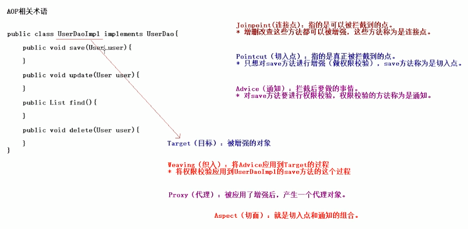

SpringAOP
===
- AOP基础
- AOP底层实现
- Spring传统AOP 
  - 不带切入点的切面
  - 带有切入点的切面
- Spring传统AOP自动代理
  - 基于Bean名称的自动代理
  - 基于切面信息的自动代理
  - 
### AOP Aspect Oriented Programming
> 面向切面编程，采横向抽取机制,取代传统纵向继承体系重复性代码(性能监视,
> 事任管理,安全检查,缓存)
- AOP相关术语
  - Joinpoint(连接点):所谓连接点是指那些被拦截到的点.在spring中这些点指的是方法,因为spring只支持方法类型的连接点
  - Pointcut(切入点):所谓切入点是值我们要对那些Joinpoint进行拦截的定义
  - Advice(通知/增强):所谓通知是指拦截到Joinpoint之后所要做的事情就是通知
    - 通知分为:前置通知,后置通知,异常通知,最终通知,环绕通知(切面要完成的功能)
    - Introduction(引介):是一种特殊的通知在不修改类代码的前提下,Introduction可以在运行期为类动态地添加一些方法或Field
  - Target(目标对象):代理的目标对象
  - Weaving(织入):是指吧增强引用到目标对象来创建新的代理对象的过程.spring采用动态代理织入,而AspectJ采用编译器织入和类装载期织入
  - Proxy(代理):一个类被AOP织入增强后,就会产生一个结果代理类
  - Aspect(切面):是切入点和通知(引介)的结合
  

#### AOP的底层实现
- JDK动态代理
- CGLIB动态代理
Jdk动态代理  (只能对实现接口的类产生代理)
```
public class MyJdkProxy implements InvocationHandler {
    private UserDao userDao;
    public MyJdkProxy(UserDao userDao) {
        this.userDao = userDao;
    }


    public Object createProxy() {
        Object proxy = Proxy.newProxyInstance(userDao.getClass().getClassLoader(),userDao.getClass().getInterfaces(),this);
        return proxy;
    }

    public Object invoke(Object proxy, Method method, Object[] args) throws Throwable {
        if ("save".equals(method.getName())) {
            System.out.println("权限校验");
            return method.invoke(userDao,args);
        }
        return method.invoke(userDao,args);
    }
}


    @Test
    public void demo1() {
        UserDao userDao = new UserDaoImpl();
        UserDao proxy = (UserDao) new MyJdkProxy(userDao).createProxy();
        proxy.update();
        proxy.delete();
        proxy.save();

        proxy.find();
    }

```
CGLIB 动态代理   (生成一个类来继承目标类)
```
public class MyCglibProxy implements MethodInterceptor {
    private ProductDao productDao;
    public MyCglibProxy(ProductDao productDao) {
        this.productDao = productDao;
    }
    public Object createProxy() {
        //1 创建核心类
        Enhancer enhancer = new Enhancer();
        //2 设置父类
        enhancer.setSuperclass(productDao.getClass());
        //3 设置回调
        enhancer.setCallback(this);
        //4 生成代理
        Object proxy = enhancer.create();
        return proxy;
    }

    public Object intercept(Object o, Method method, Object[] objects, MethodProxy methodProxy) throws Throwable {
        if ("save".equals(method.getName())) {
            System.out.println("权限校验");
            return methodProxy.invokeSuper(o,objects);
        }
        return methodProxy.invokeSuper(o,objects);
    }
}


    @Test
    public void demo1() {
        ProductDao productDao = new ProductDao();
        ProductDao proxt = (ProductDao) new MyCglibProxy(productDao).createProxy();

        proxt.delete();
        proxt.find();
        proxt.save();

        proxt.update();
    }
```
#### 代理知识总结
- Spring在运行期,生成动态代理对象,不需要特殊的编译器
- Spring AOP的底层就是通过JDK动态代理或CGLib动态代理技术为目标Bean执行横向织入
  - 1.若目标对象实现若干接口,spring使用JDK的java.lang.reflect.Proxy类代理
  - 2.若目标对象没有实现任何接口,spring实现CGLIB库生成目标对象的子类
- 程序中应优先对接口创建代理,便于程序解耦维护
- 编辑final的方法,不能被代理,因为无法进行覆盖
  - JDK动态代理,是针对接口生成子类,接口中方法不能使用final修饰
  - CGLib是针对目标类生产子类,因此类或方法,不能使final的
- Spring只支持方法的连接点,不提供属性连接点

### Spring的一般切面编程案例
####  Spring AOP增强类型
> AOP联盟为通知Advice定义org.aoplliance.aop.Interface.Advice
- Spring按照通知Adivce在目标类方法的连接点位置,可以分为5类
  - 前置通知 org.springframework.aop.MethodBeforeAdvice
    - 在目标方法执行前实施增强
  - 后置通知 org.springframework.aop.AfterReturningAdvice
    - 在目标方法执行后实施增强
  - 环绕通知 org.aopalliance.intercept.MethodInterceptor
    - 在目标方法执行前后实施增强
  - 异常抛出通知 org.springframework.aop.ThrowsAdvice
    - 在方法抛出异常后实施增强
  - 引介通知 org.springframework.aop.IntroductionInterceptor
    - 在目标类中添加一些新的方法和属性
#### Spring的AOP的切面类型的介绍
- Advisor 代表一般切面,Advice本身就是一个切面,对目标类所有方法进行拦截
- PointcurAdvisor 代表具有切点的切面,可以指定拦截目标类那些方法
- IntroductionAdvisor 代表引介切面,针对引介通知而使用切面
#### Advisor切面案例
- ProxyFactoryBean常用配置属性
  - target 代理的目标对象
  - proxyInterfaces 代理要实现的接口
    - 如果多个接口可以使用一下格式赋值
        ```
        <list>
            <value></value>
            ...
        </list>
        ```
    ```
    public class MyBeforeAdvice implements MethodBeforeAdvice {
        public void before(Method method, Object[] objects, Object o) throws Throwable {
            System.out.println("this is before enhance");
        }
    }


    <!--  配置目标类-->
    <bean id="studentDao" class="com.dollarkiller.demo3.StudentDaoImpl"></bean>

    <!--  前置通知-->
    <bean id="myBeforeAdvice" class="com.dollarkiller.demo3.MyBeforeAdvice"/>
    <!--Spring AOP产生代理对象-->
    <bean id="studentDaoProxy" class="org.springframework.aop.framework.ProxyFactoryBean">
        <!--目标类-->
        <property name="target" ref="studentDao"/>
        <!--实现接口-->
        <property name="proxyInterfaces" value="com.dollarkiller.demo3.StudentDao" />
        <!--采用拦截的名称-->
        <property name="interceptorNames" value="myBeforeAdvice" />
    </bean>
    ```
  - proxtTargetClass:是否对类代理而不是接口,设置为true时,使用CGLib代理
  - interceptorNames:需要织入目标的Advice
  - singleton:返回代理是否是单例,默认是单例
  - optimeize:当设置为true时,强制使用CGLib
##### PointcurAdvisor 切点切面
- 使用普通Advice作为切面,将对目标类所有方法进行拦截,不够灵活,在实际开发中常采用带有切点的切面
- 常用普通Advice作为切面,将对目标所有方法进行拦截,不够灵活,在实际开发中常采用,带有切点的切面
  - 常用PointcutAdvisor实现类
    - DefaultPointcutAdvisor最常用的切面类型,他可以通过任意Pointcut和Advice组合定义切面
    - JdkRegexpMethodPointcut构造正则表达式 
```
    <!--目标类-->
    <bean id="customerDao" class="com.dollarkiller.demo4.CustomerDao"/>
    <!--配置通知-->
    <bean id="myAroundAdvice" class="com.dollarkiller.demo4.MyAroundAdvice"/>
    <!--一般的切面是使用通知作为切面,因为要对目标类某个方法进行增强就需要配置一个带有切入点的切面-->
    <bean id="myAdvisor" class="org.springframework.aop.support.RegexpMethodPointcutAdvisor" >
        <!--pattern配置正则表达式-->
<!--        <property name="pattern" value=".*save.*" />-->
        <property name="patterns" value=".*save.*,.*delete.*" />
        <property name="advice" ref="myAroundAdvice" />
    </bean>
    <!--配置产生代理-->
    <bean id="customerDaoProxy" class="org.springframework.aop.framework.ProxyFactoryBean">
        <property name="target" ref="customerDao"/>
        <!--没有实现接口配置-->
        <property name="proxyTargetClass" value="true" />
        <property name="interceptorNames" value="myAdvisor" />
    </bean>
```
### Spring的传统AOP的动态代理
> 在开发案例中,每一个代理都是通过ProxyFactoryBean织入切面代理,在实际开发中,非常多的Bean每个配置ProxyFactoryBean开发维护量巨大
- 解决方案:自动创建代理
  - BeanNameAutoProxyCreator 更具Bean名称创建代理
  - DefaultAdvisorAutoProxyCreator 更具Advisor本身包含信息创建代理
  - AnnotationAwareAspectJAutoProxyCreator 基于Bean中的AspectJ注解进行自动代理
- BeanNameAutoProxyCreator 更具Bean名称自动代理
  - 对所有Dao结尾的Bean所有方法,使用代理
    ```
    配置目标类
    <bean id="productDao" class="....">
    <bean id="custommerDao" class="....">
    配置通知
    <bean id="beforAdvice" class="...">
    配置完整自动代理
    <bean class="BeanNameAutoProxyCreator">
        配置bean名称
        <property name="beanNames" value="*Dao">
        配置拦截名称
        <property name="interceptorNames" values="beforeAdvice">
    </bean>
    ```
    ```
    <!--    配置目标类-->
    <bean id="studentDao" class="com.dollarkiller.demo5.StudentDaoImpl"/>
    <bean id="customerDao" class="com.dollarkiller.demo5.CustomerDao"/>

    <!--    配置增强-->
    <bean id="myBeforeAdvice" class="com.dollarkiller.demo5.MyBeforeAdvice"/>
    <bean id="myAroundAdvice" class="com.dollarkiller.demo5.MyAroundAdvice"/>

    <bean class="org.springframework.aop.framework.autoproxy.BeanNameAutoProxyCreator">
        <property name="beanNames" value="*Dao"/>
        <property name="interceptorNames" value="myBeforeAdvice"/>
    </bean>
    ```
  - 基于Bean名称的自动代理所有的方法都会被增强,代理启动在类生成前
- DefaultAdvisorAutoProxyCreator
  - 基于切面产生代理
    ```
    <!--    配置目标类-->
    <bean id="studentDao" class="com.dollarkiller.demo6.StudentDaoImpl"/>
    <bean id="customerDao" class="com.dollarkiller.demo6.CustomerDao"/>

    <!--    配置增强-->
    <bean id="myBeforeAdvice" class="com.dollarkiller.demo6.MyBeforeAdvice"/>
    <bean id="myAroundAdvice" class="com.dollarkiller.demo6.MyAroundAdvice"/>

    <!--    配置切面-->
    <bean id="myAdvice" class="org.springframework.aop.support.RegexpMethodPointcutAdvisor">
        <property name="pattern" value="com\.dollarkiller\.demo6\.CustomerDao\.save" />  // \.是转义
        <property name="advice" ref="myAroundAdvice" />
    </bean>


    <bean class="org.springframework.aop.framework.autoproxy.DefaultAdvisorAutoProxyCreator"></bean>
    ```